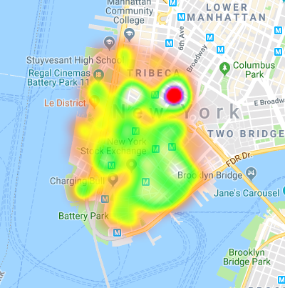

# Google-Maps-Python
How to Generate a Geographical Heatmap with Python
# Let's get started
This tutorial will show you how to create an interactive heatmap overlaying Google maps. The end result will be an HTML file that you can open and zoom in/out of or pan through to visualize your customer addresses. Our end result will look like this.

For this tutorial we will be using the gmplot library. More information and requirements can be found here.

To install use pip install gmplot

The dataset we will be using dataset from mysql databases.

In this dataset the values we will be using are the LAT and LON columns which represent the lattitude and longitude for each of the residents in the dataset. We also see that there are almost 1 million records. We are going to reduce that size for our example to just the first 15,000 records.

contributor https://eatsleepdata.com

